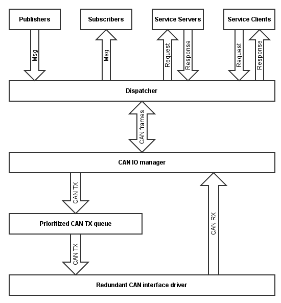

---
---

# Adding support for a new platform

Implementing a platform driver for libuavcan is generally a quite straightforward task,
especially if the driver is targeted for a certain application and need not to be generic.

Essentially, a libuavcan driver is a set of C++ classes implementing the following C++ interfaces:

* `uavcan::ICanDriver`
* `uavcan::ICanIface`
* `uavcan::ISystemClock`

Listed interfaces are defined in
[`libuavcan/include/uavcan/driver/`](https://github.com/UAVCAN/libuavcan/blob/master/libuavcan/include/uavcan/driver).

Note that the library core already includes a non-blocking prioritized TX queue, so normally the driver should not
implement software TX queue itself.

If the driver does not need to support redundant CAN bus interfaces,
then the first two C++ interfaces can be implemented in the same C++ class.

Some features can be left unimplemented:

* IO flags and TX timestamping - needed for clock synchronization master.
* Hardware CAN filters configuration -
not necessary if there is enough computational power to delegate filtering to the library software.

There are two polar examples of the driver complexity level that can give a basic idea of the development effort required:

* LPC11C24 driver - only necessary functionality, no redundant interface support, no TX timestamping - 600 LoC.
* Linux driver - complete full-featured driver with hardware timestamping and redundant interfaces - 1200 LoC.

Contributions adding support for new platforms are always welcome.
