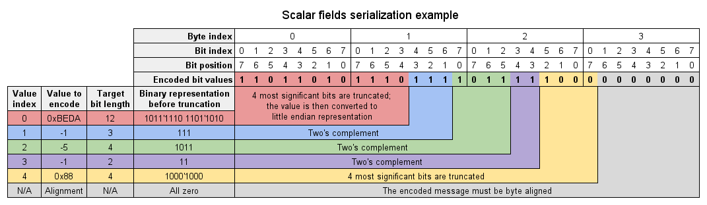

---
---

# Data structure description language

The data structure description language (DSDL) is used to define data structures for exchange via the CAN bus.
Every data structure is defined in a separate DSDL definition file.
DSDL definition is then used to automatically generate the serialization/deserialization codes for a certain
programming language.
The tool that generates source codes from DSDL definition files is called the *DSDL compiler*.

## File hierarchy

A DSDL definition file defines exactly one data structure.
The defined data structure can be used for either of these data exchange modes:

* Message broadcasting
* Service invocation

A defined data structure shall be contained in a namespace.
A namespace may be nested in another namespace, in which case it is called a *nested namespace*.
A namespace that is not nested in another namespace is called a *root namespace*.
Example: All standard data types are contained in the root namespace `uavcan`, which, in turn,
contains nested namespaces, e.g., `equipment`, `protocol`, etc..

Data type name shall be defined by the DSDL source file name as follows:

    <data type name>.uavcan

The default data type ID, if needed, shall be defined by the DSDL source filename as follows:

    <default data type ID>.<data type name>.uavcan

Namespace hierarchy is defined by the directory hierarchy of DSDL definitions, where directories represent namespaces,
as shown on the example below:

```
+ uavcan                        <-- Root namespace
    + equipment                 <-- Nested namespace
        + ...
    + protocol                  <-- Nested namespace
        + 341.NodeStatus.uavcan <-- Definition of data type "uavcan.protocol.NodeStatus" with default data type ID 341
        + ...
    + Timestamp.uavcan          <-- Definition of data type "uavcan.Timestamp", default data type ID is not assigned
```

Note that it is not necessary to explicitly define a default data type ID for non-standard data types
(i.e., for vendor-specific or application-specific data types).
If the default data type ID is not defined by the DSDL definition, it will need to be assigned by the application at
run time.
Note that all standard data types have default data type ID values defined.

Data type names are case sensitive, i.e., names `foo.Bar` and `foo.bar` are considered different.
Despite this, names that differ only in case should be avoided, because it may cause problems on file systems that
are not case-sensitive.

Data types may contain nested data structures.
Some data structures may be designed for such nesting only, in which case they are not required to have a dedicated
data type ID at all.

*Full data type name* is a unique identifier of a data type constructed from the root namespace,
all nested namespaces (if any), and the data type name itself, joined via the dot symbol (`.`),
e.g., `uavcan.protocol.file.Read`.
Full data type name length must not exceed 80 characters.
Also, refer to the naming rules below for the limitations imposed on the character set.

### Service data structure

Since a service invocation consists of two network exchange operations, the DSDL definition for a service must define two structures:

* Request part - for request transfer (client to server).
* Response part - for response transfer (server to client).

Both request and response structures are contained within the same DSDL definition file,
but separated by a special statement (see the syntax chapter below).

Service invocation data structures cannot be nested.

## Syntax

A data structure definition consists of *attributes* and *directives*.
Any line of the definition file may contain at most one attribute definition or at most one directive.
The same line cannot contain an attribute definition and a directive at the same time.

An attribute can be either of the following:

* *Field* - a variable that can be modified by the application and exchanged via the network.
* *Constant* - an immutable value that does not participate in network exchange.

A directive is a statement that provides instructions to the DSDL compiler.

Aside from attributes and directives, a DSDL definition may contain the following entities:

* Comments
* Service response marker

The details are explained below.

A DSDL definition for a message data type may contain only the following:

* Attribute definitions (zero or more)
* Directives (zero or more)
* Comments (optional)

A DSDL definition for a service data type may contain only the following:

* Request part attribute definitions (zero or more)
* Response part attribute definitions (zero or more)
* Directives (zero or more)
* Comments (optional)
* Service response marker (exactly one)

### Attribute definition

Field definition patterns:

1. `cast_mode field_type field_name`
2. `cast_mode field_type[X] field_name`
3. `cast_mode field_type[<X] field_name`
4. `cast_mode field_type[<=X] field_name`

Constant definition pattern:

1. `cast_mode constant_type constant_name = constant_initializer`

Each component is discussed below.

#### Field type

Can be either a primitive data type (primitive data types are defined below) or a nested data structure.

A primitive data type can be referred simply by name, e.g., `float16`, `bool`.

A nested data structure can be referred by either of these two:

* Short name, e.g., `NodeStatus`, if both the referred and the referring data types are located in the same namespace.
For example, it is possible to access `ns1.ns2.Type1` from `ns1.ns2.Type2` using a short name, but not from
`ns1.ns2.ns3.Type3` or `ns1.ns4.Type4`.
* Full name, e.g., `uavcan.protocol.NodeStatus`. A full name allows to reach the data type from any namespace.

A field type name can be appended with a statement in square brackets to define an array:

* Syntax `[X]` is used to define a static array of size exactly X items.
* Syntax `[<X]` is used to define a dynamic array of size from 0 to X-1 items, inclusively.
* Syntax `[<=X]` is used to define a dynamic array of size from 0 to X items, inclusively.

In the array definition statements above, X must be a valid integer literal according to the rules defined in the
section dedicated to constant definitions.

Arrays of maximum size with less than one item are not allowed. Multidimensional arrays are not allowed.

#### Field name and constant name

For a message data type, all attributes must have a unique name within the data type.

For a service data type, all attributes must have a unique name within the same part (request/response)
of the data type.
In other words, it is allowed to have attributes of the same name as long as they are separated by the service
response marker.

#### Cast mode

Cast mode defines the rules of conversion from the native value of a certain programming language to the serialized
field value.
Cast mode may be left undefined, in which case the default will be used.
Possible cast modes are defined below.

* `saturated` - This is the default cast mode, which will be used if the attribute definition does not define
the cast mode explicitly.
For integers, it prevents an integer overflow - for example, attempting to write 0x44 to a 4-bit field will result
in a bitfield value of 0x0F.
For floating point values, it prevents overflow when casting to a lower precision floating point representation -
for example, 65536.0 will be converted to a `float16` as 65504.0; infinity will be preserved.

* `truncated` - For integers, it discards the excess most significant bits - for example, attempting to write
0x44 to a 4-bit field will result in a bitfield value of 0x04.
For floating point values, overflow during downcasting will produce an infinity.

#### Constant definition

A constant must be a primitive scalar type, i.e., arrays and nested data structures are not allowed as constant types.

A constant must be assigned with a constant initializer, which must be one of the following:

* Integer literal in base 10, starting with a non-zero character. E.g., 123, -12.
* Integer literal in base 16 prefixed with `0x`. E.g., 0x123, -0x12.
* Integer literal in base 2 prefixed with `0b`. E.g., 0b1101, -0b101101.
* Integer literal in base 8 prefixed with `0o`. E.g., 0o123, -0o777.
* Floating point literal. Fractional part with an optional exponent part, e.g.,
`15.75`, `1.575E1`, `1575e-2`, `-2.5e-3`, `25E-4`.
Note that the use of infinity and NAN (not-a-number) is discouraged as it may not be supported on all platforms.
* Boolean `true` or `false`.
* Single ASCII character, ASCII escape sequence, or ASCII hex literal in single quotes. E.g., `'a'`, `'\x61'`, `'\n'`.

The DSDL compiler shall implicitly convert the type of an initializer expression to the constant type if
the target type can allocate the value with no data loss.
If a data loss occurs (e.g., integer overflow, floating point number decays to infinity), the DSDL compiler
should refuse to compile such data type.

Note that constants do not affect the serialized data layout as they are never exchanged via the network.

### Directives

A directive is a single case-sensitive word starting with an "at sign" `@`,
possibly followed by space-separated arguments:

* `@directive`
* `@directive arg1 arg2`

All valid directives are documented below.

#### Union

Keyword: `@union`.

This directive instructs the DSDL compiler that the current message or the current part of
a service data type (request or response) is a tagged union.
A tagged union is a data structure that may encode either of its fields at a time.
Such a data structure contains one implicit field - a *union tag*, which indicates what particular field the
data structure is holding at the moment.
Unions are required to have at least two fields.

This directive must be placed before the first attribute definition.

The encoding rules for tagged unions are defined in the following chapters.

### Comments

A DSDL description may contain comments starting from a number sign `#` up to the end of the line.
Comments must be ignored by the DSDL compiler.

### Service response marker

A service response marker separates the request and response parts of a service data type definition.
The marker consists of three minus symbols (`-`) in a row on a dedicated line:

```
---
```

## Primitive data types

These types are assumed to be built-in.
They can be directly referred from any data type of any namespace.
The DSDL compiler should implement these types using the native types of the target programming language.
Example mapping to native types is given for C/C++.

Name      | Bit length           | Possible representation in C/C++              | Value range                                       | Binary representation
----------|----------------------|-----------------------------------------------|---------------------------------------------------|-----------------------
bool      | 1                    | `bool` *(can be optimized for bit arrays)*    | {0, 1}                                            | One bit
int**X**  | 2 &le; **X** &le; 64 | `int8_t`, `int16_t`, `int32_t`, `int64_t`     | [-(2<sup>**X**</sup>)/2, 2<sup>**X**</sup>/2 - 1] | [Two's complement](http://en.wikipedia.org/wiki/Two's_complement)
uint**X** | 2 &le; **X** &le; 64 | `uint8_t`, `uint16_t`, `uint32_t`, `uint64_t` | [0, 2<sup>**X**</sup> - 1]                        |
float16   | 16                   | `float`                                       | &plusmn;65504                                     | [IEEE754](http://en.wikipedia.org/wiki/IEEE_754) binary16
float32   | 32                   | `float`                                       | Approx. &plusmn;10<sup>39</sup>                   | [IEEE754](http://en.wikipedia.org/wiki/IEEE_754) binary32
float64   | 64                   | `double`                                      | Approx. &plusmn;10<sup>308</sup>                  | [IEEE754](http://en.wikipedia.org/wiki/IEEE_754) binary64

## Naming rules

### Mandatory

Field names, constant names, and type names must contain only ASCII alphanumeric characters and underscores
(`[A-Za-z0-9_]`), and must begin with an ASCII alphabetic character (`[A-Za-z]`).
Violation of this rule must be detected by the DSDL compiler and treated as a fatal error.

### Optional

The following rules are not mandatory to follow, and DSDL compilers are not required to enforce them:

* Field names and namespace names should be all lowercase with underscores (e.g., `field_name`, `my_namespace`).
* Constant names should be all uppercase with underscores (e.g., `CONSTANT_NAME`).
* Data type names should be in camelcase with the first letter in uppercase (e.g., `TypeName`).

### Advisory

The following rules should be considered by the application designer, but should not be enforced:

* Message names should be nouns or adjectives; service names should be verbs.
* The name of a message that carries a command should end with the word "Command";
the name of a message that carries state information should end with the word "Status".
* The name of a service that is designed to obtain or to store data should begin with the word "Get" or "Set",
respectively.

## Data type compatibility

### The concept of data type compatibility

It is vital that all nodes exchanging some particular data structure use compatible DSDL definitions of it.
Different DSDL definitions are considered compatible if they share the aspects listed below.

#### Binary layout

Compatible data structures must feature the same field types in the same order.

First definition:

    uint8 a
    uint8 b

Second definition:

    uint12 a
    uint4 b

Even though the bit length of the data structures above is the same, the binary layout is clearly not compatible.

#### Field naming

Encoded binary representation must be interpreted by different nodes in the same way, which implies that field names
must match exactly.

First definition:

    uint8 a
    uint8 b

Second definition:

    uint8 b
    uint8 a

Even though the first and the second definitions share the same binary layout (two fields of type `uint8`),
they feature different field names and therefore are semantically incompatible.

#### Constant definitions

Despite the fact that different constant values may render the different representations of the same data structure
semantically incompatible, UAVCAN does not consider constant definitions in signature computation, because fixing
constant definitions renders data types not extensible, i.e., any modification of a constant would break backward
compatibility.

### Signature

It is obvious from the above that incompatible data types may break the data exchange and cause unpredictable
system behavior; hence the problem of type compatibility must be properly accounted for.
In order to ensure type compatibility, the concept of data type signature is introduced.

Some auxiliary concepts are discussed below that are required to define the concept of data type signature.

#### Signature hash function

The data type signature is based on CRC-64-WE:

* Name: CRC-64-WE
* Description: http://reveng.sourceforge.net/crc-catalogue/17plus.htm#crc.cat-bits.64
* Initial value: 0xFFFFFFFFFFFFFFFF
* Poly: 0x42F0E1EBA9EA3693
* Reverse: no
* Output XOR: 0xFFFFFFFFFFFFFFFF
* Check: 0x62EC59E3F1A4F00A

Source code in Python:

```python
# License: CC0, no copyright reserved
class Signature:
    MASK64 = 0xFFFFFFFFFFFFFFFF
    POLY = 0x42F0E1EBA9EA3693

    def __init__(self, extend_from=None):
        if extend_from is not None:
            self._crc = (int(extend_from) & Signature.MASK64) ^ Signature.MASK64
        else:
            self._crc = Signature.MASK64

    def add(self, data_bytes):
        if isinstance(data_bytes, str):
            data_bytes = map(ord, data_bytes)
        for b in data_bytes:
            self._crc ^= (b << 56) & Signature.MASK64
            for _ in range(8):
                if self._crc & (1 << 63):
                    self._crc = ((self._crc << 1) & Signature.MASK64) ^ Signature.POLY
                else:
                    self._crc <<= 1

    def get_value(self):
        return (self._crc & Signature.MASK64) ^ Signature.MASK64
```

#### Normalized data type definition

Some traits of a data type are important to ensure compatibility and some are not.
A normalized data type definition is a definition that does not have such unimportant traits.

To obtain a normalized definition of a given data type, the following actions must be performed on a data type:

1. Remove comments.
2. Remove all constant definitions.
3. Ensure that all cast specifiers are explicitly defined; if not, add default cast specifiers.
4. For dynamic arrays, replace the max length specifier in the form `[<X]` to the form `[<=Y]`.
5. Remove unimportant whitespaces (empty lines, leading whitespaces, trailing whitespaces,
more than one whitespace between tokens).
6. Prepend the DSDL definition with the full data type name on a separate line.
7. Replace newline characters with the ASCII line-feed character (code: 0x0A; escape sequence: `\n`).

Example for message type `A` in the namespace `root`:

```
#
# A header comment.
# Note that the formatting is broken deliberately.
#

@union

float16 foo

float16 BAR    = 12.34  # This is BAR
truncated uint8    bar

int32  FOO =   - 42
```

Normalized definition:

    root.A
    @union
    saturated float16 foo
    truncated uint8 bar

Example for service type `A` in the namespace `root`:

```
#
# A header comment.
# Note that the formatting is broken deliberately.
#

float16 foo
float16 BAR    = 12.34  # This is BAR
---

truncated uint8    foo
int32  BAR =   -42
```

Normalized definition:

    root.A
    saturated float16 foo
    ---
    truncated uint8 foo

#### DSDL signature

DSDL signature is the product of the application of the *signature hash function*
to a *normalized data type definition*.

It is important to understand that DSDL signature is not the same as data type signature.

#### Data type signature

Data type signature is a 64-bit integer value that is *guaranteed to be equal for compatible data types*.

Hence, it is said that *data types are compatible if their names and signatures are equal*.

The following is a data type signature computation algorithm for a given data type,
where *hash* is the signature hash function described earlier:

1. Initialize the hash value with the DSDL signature of the given type.
2. Starting from the top of the DSDL definition, do the following for each nested data structure:
  1. Extend the current hash value with the data type signature of the nested data structure.
3. The resulting hash value will be the data type signature.

The hash extension algorithm:

1. Save the current hash value.
2. Feed the value the hash needs to be extended with to the hash function, byte by byte, LSB first.
3. Feed the saved hash value to the hash function, byte by byte, LSB first.

The data type signature computation algorithm has the following properties:

* Data type signature and DSDL signature of the same type are equal if the data type does not contain nested data structures.
* Data type signature is guaranteed to match only if all nested data structures are compatible.

The implementation of the algorithm explained above can be found in one of the existing implementations.

#### Aggregate signature

Aggregate data type signature is a signature computed for a set of data types.

Aggregate data type signature is useful for checking the compatibility between two sets of data types.

Two sets of data types **X** and **Y** are compatible if each data type in **X** has exactly one compatible data type
in **Y** and both sets are of equal size.

One possible way to ensure compatibility between **X** and **Y** is to directly check the compatibility of each element
from **X** against each element from **Y**.
UAVCAN, however, defines a computationally less expensive algorithm based on data type signature extension
(as defined above).

The algorithm that computes the aggregate signature for the set of data types **A** is defined as follows,
where *hash* is the signature hash function described earlier:

1. Sort **A** by full data type name lexicographically in descending order (encoding is ASCII, order is A to Z).
2. Initialize the hash value with the data type signature of the first data type from **A**.
3. For each data type **a** from **A**, starting from the second, do the following:
  1. Extend the current hash value with the data type signature of **a**.

Then, *two sets of data types are considered to be compatible if their aggregate signatures are equal*.

## Data type ID

The set of possible data type ID values is limited, so the devices from different vendors may occasionally reuse the
same data type ID for different purposes.
A part of the data type ID space is dedicated for standard data types, and since all UAVCAN nodes should share the
same configuration of standard data types, collisions are unlikely to happen here.
Another part of the data type ID space is dedicated for vendor-specific (or application-specific) ID space,
which is always collision prone.

In order to allow the nodes from different vendors to be used in the same application,
*the end user must be able to change the ID of any non-standard data type on each node*.
Also, the vendors are advised to provide the end user with an option to change the ID of any standard message type as
well.

Note that message types and service types do not share the same set of possible data ID values,
i.e., a message type and a service type can share the same data type ID with no conflict
(learn more about this in the [CAN bus transport layer specification](4._CAN_bus_transport_layer.html)).

Note that ID change does not render the data types incompatible.

## Data serialization

### Serialized data format

Serialized data are an ordered sequence of bit fields; no header or footer is provided, and fields are
not aligned implicitly.
The rules of encoding of different data types are defined below.

#### Primitive types

Type      | Bit length    | Binary representation
----------|---------------|--------------------------------------------------------------------------------------------
int**X**  | **X**         | [Two's complement](http://en.wikipedia.org/wiki/Two's_complement) signed integer
uint**X** | **X**         | Plain bits
bool      | 1             | Single bit
float16   | 16            | [IEEE754](http://en.wikipedia.org/wiki/IEEE754) binary16
float32   | 32            | [IEEE754](http://en.wikipedia.org/wiki/IEEE754) binary32
float64   | 64            | [IEEE754](http://en.wikipedia.org/wiki/IEEE754) binary64

#### Nested data structures

Nested data structures are encoded in much the same way as if they were standalone top-level data structures,
with one exception for *tail array optimization*, as defined below.

#### Fixed size arrays

Fixed-size arrays are encoded as a plain sequence of items, with each item encoded independently in place
with no alignment.
No extra data added.

Essentially, a fixed-size array of size **X** will be encoded exactly in the same way as a sequence of
**X** fields of the same type in a row. Hence, the following data type:

    AnyType[3] array

will have the same binary layout as:

    AnyType array_0
    AnyType array_1
    AnyType array_2

The only difference is the representation in the target programming language.

#### Dynamic arrays

Dynamic array encoding rules are sophisticated; hence it is recommended to consult the existing implementations for a
deeper understanding.

There is no difference between the following two array definitions other than text representation for the human benefit:

    AnyType[<42]  a # Max size 41
    AnyType[<=41] b # Max size 41

Both forms are equivalent in terms of the data serialization.

Array items can be of variable length; for example, if the item's type is a data structure that contains dynamic
arrays itself, so the minimum and maximum size of an array item are not always the same.

Normally, a dynamic array will be encoded as a sequence of encoded items, prepended with an unsigned integer field
representing the number of contained items - the *length field*.
The bit width of the length field is a function of the maximum number of items in the array:
`⌈log2(X + 1)⌉`, where X is the maximum number of items in the array.
For example, if the maximum number of items is 251, the length field bit width must be 8 bits,
or if the maximum number of items is 1, the length field bit width will be just a single bit.

The transport layer provides a data length for every received data transfer (with an 8-bit resolution);
thus, in some cases, the array length information would be redundant as it can be inferred from the overall transfer
length reported by the transport layer.
Elimination of a dynamic array length field is called *tail array optimization*,
and it can be done if all the conditions below are satisfied:

1. The minimum bit length of an item type is not less than 8 bits - because the transport layer reports a transfer length with an 8-bit resolution.
2. The array is the last field in the top-level data structure - because, otherwise, a much more complicated logic would be required to derive the length.

The second condition means that tail array optimization would be possible only if there are no other fields in the
output bit stream after the dynamic array.
Only one array can be tail optimized.
Below are some examples that illustrate when a tail array optimization is possible and when it is not.

```
# Type root.A
uint8 foo
# Tail array optimization is possible here
# It will be encoded just like a fixed-size array
# The number of elements will be inferred from the transfer length
uint8[<9] array

# Type root.B
float16 foo
# Tail array optimization will not be possible because item length is less than 8 bits
uint7[<=8] array

# Type root.C
# Tail array optimization will not be possible because the array is not the last field
uint8[<=8] array
float16 bar

# Type root.D
# Tail array optimization will not be possible because item length is less than 8 bits
bool[<=42] array

# Type root.E
# Tail array optimization will not be possible because the minimum item length is zero
root.D[<=42] array     # Refer to root.D definition above
```

The same rules are applied to more sophisticated cases when multiple nested types with dynamic arrays are used.
Such structure may produce very complex binary layouts, but the same array encoding rules are still applicable.

```
# Type root.Z
# Refer to root.A definition above
# This array will be tail optimized
# Arrays inside root.A will not be tail optimized
root.A[<=2] array

# Type root.Y
# This array will NOT be tail optimized
# Arrays inside root.A will NOT be tail optimized
root.A[<=2] array
# The last field here effectively disables any arrays from being tail optimized
float16 baz

# Type root.Q
int4 fooz
# Just an array that can be tail optimized, no nested types
float64[<=64] array

# Type root.X
# This array will NOT be tail optimized
# Because the minimum bit length of root.Q is 4 bits (less than 8 bits)
# However, the last array in the last item will be tail optimized
root.Q[<=12] array
```

The application designer is advised to keep in mind the tail array optimization rules when designing custom data types.

#### Unions

Unions are encoded as two subsequent entities:

1. The union tag;
2. The selected field.

The union tag is an unsigned integer, whose bit length is a function of the number of fields in the union:
`⌈log2(N)⌉`, where N is the number of fields in the union.
The value encoded in the union tag is the index of the selected field.
Field indexes are assigned according to the order in which they are defined, starting from zero;
i.e. the first defined field gets index 0, second defined field gets index 1, and so on.

Consider the following example:

```
#
# This is a union.
#

@union                  # In this case, the union tag requires 2 bits

uint16 FOO = 42         # A regular constant attribute

uint16 a                # Index 0
uint8 b                 # Index 1
float64 c               # Index 2

uint32 BAR = 42         # Another regular constant
```

In order to encode the value `b`, which, according to the definition, has the data type `uint8`, the union
tag should be assigned the value 1. The following structure will have identical layout:

```
uint2 tag
uint8 b
```

In the way of an example, if the value of `b` was 7, the resulting encoded byte sequence would be (in binary):

    01000001 11000000

### Byte order and bit order

Byte order: least significant byte (LSB) first, also known as little-endian.

Bit order: bits are filled from the most significant to the least significant,
i.e., the most significant bit has index 0.

The resulting bit sequence must be aligned to 1 byte; pad bits must be set to zero.

For the purpose of example, the following data will be encoded according to the defined order:

1. 0xbeda of bit length 12
2. -1 of bit length 3
3. -5 of bit length 4
4. -1 of bit length 2
5. 0x88 of bit length 4

The resulting byte sequence is shown on the following diagram:



It is recommended to consult with the existing implementations.

## Standard data types

The DSDL definitions of the standard data structures are available in the DSDL repository,
which is linked [here](/Contact.html).

Information concerning development and maintenance of the standard DSDL definitions is available
[here](1._Introduction.html).
