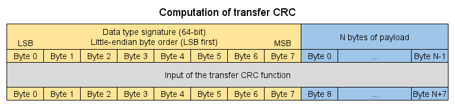
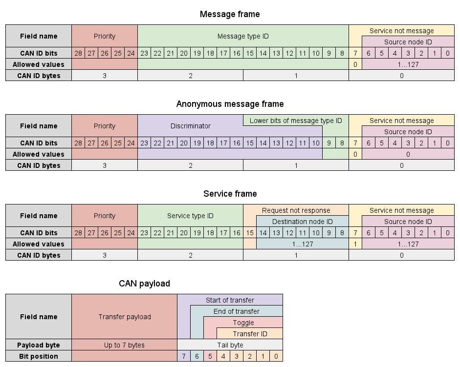
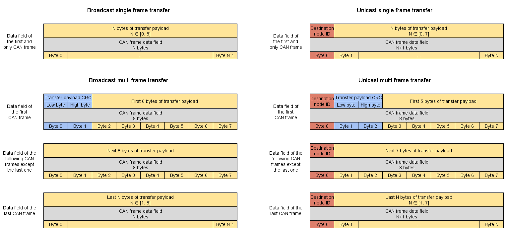

---
---

# CAN bus transport layer

## Transfer concept

As described in the chapter dedicated to the basic concepts of UAVCAN,
two methods of data exchange are used by the nodes of the UAVCAN network to communicate:

* Message publication
* Service invocation

*Transfer* is a single act of data transmission from source node to either single remote node
(**unicast transfer**) or all other nodes (**broadcast transfer**), upon which all methods of data exchange are based.

* Message publication - one transfer, either unicast or broadcast.
* Service invocation - two subsequent unicast transfers:
  * From caller to server, i.e., request.
  * From server to caller, i.e., response.

Both unicast and broadcast transfer distinguish between *single-frame transfer* (*SFT*)
and *multi-frame transfer* (*MFT*).
Single-frame transfer consists of a single CAN frame;
it is used when the transfer payload length is short enough to fit into a single CAN frame.
Multi-frame transfer consists of data decomposed into multiple CAN frames; it is used for exchanging long payloads.

When a node transmits a multi-frame transfer, all CAN frames of this transfer are pushed to the bus at once,
in the proper order from the first frame to the last frame.
The transport layer does not define any means of flow control for the following reasons:

* It would perform poorly with broadcast signal-based data exchange.
* Receiving nodes will not be able to process frames as they arrive anyway because all frames of a transfer
must be received first before the encoded data structure can be deserialized and checked for integrity.
Thus, reception throughput is not limited by the application response time.
* Higher-level processes can implement flow control on top of the transport layer, if needed.

### Transfer properties

A transfer comprises the following properties:

 Field          | Content
----------------|------------------------------------------------------------------------------------------------------
 Payload        | The serialized data structure (refer to the chapter dedicated to DSDL)
 Data Type ID   | The identifier of the serialized data structure in the payload
 Source Node ID | The Node ID of the transmitting node
 Transfer Type  | Either: Message broadcast, Service response, or Service request
 Transfer ID    | A small overflowing integer (described later in this part)

Unicast transfer also adds the following fields:

 Field                  | Content
------------------------|----------------------------------------------------------------------------------------------
Destination Node ID     | The Node ID of the receiving node

Multi-frame transfer also adds the following fields:

 Field                  | Content
------------------------|----------------------------------------------------------------------------------------------
Transfer payload CRC    | [Cyclic redundancy check](http://en.wikipedia.org/wiki/Cyclic_redundancy_check) of the transfer; detailed description follows

### Transfer CRC

Transfer CRC is computed from the transfer payload prepended with a data type signature in little-endian byte
order (LSB first).
The diagram below illustrates the transfer CRC computation rules:



Transfer CRC parameters:

* Name: CRC-16-CCITT-FALSE
* Description: http://reveng.sourceforge.net/crc-catalogue/16.htm#crc.cat.crc-16-ccitt-false
* Initial value: 0xFFFF
* Poly: 0x1021
* Reverse: no
* Output XOR: 0
* Check: 0x29B1

Transfer CRC computation in C++:

```c++
#include <iostream>
#include <cstdint>
#include <cassert>

class TransferCRC
{
    std::uint16_t value_;

public:
    TransferCRC()
        : value_(0xFFFFU)
    { }

    void add(std::uint8_t byte)
    {
        value_ ^= static_cast<std::uint16_t>(byte) << 8;
        for (std::uint8_t bit = 8; bit > 0; --bit)
        {
            if (value_ & 0x8000U)
            {
                value_ = (value_ << 1) ^ 0x1021U;
            }
            else
            {
                value_ = (value_ << 1);
            }
        }
    }

    void add(const std::uint8_t* bytes, unsigned len)
    {
        assert(bytes);
        while (len--)
        {
            add(*bytes++);
        }
    }

    std::uint16_t get() const { return value_; }
};

int main()
{
    TransferCRC crc;
    crc.add(reinterpret_cast<const std::uint8_t*>("123456789"), 9);
    std::cout << std::hex << "0x" << crc.get() << std::endl;
}
```

## CAN frame format

As stated earlier, a transfer can be decomposed into one or more CAN frames.
Only data frames of CAN 2.0B (29-bit ID field) are used.

Since UAVCAN does not use CAN 2.0A (11-bit ID field),
other high-level CAN protocols based on CAN 2.0A can co-exist on the same network with UAVCAN.

### CAN ID field

Every CAN frame uses the same fixed format of the extended CAN ID field (29 bits in total).
The extended CAN ID field bit assignment, from high bit to low bit, is as follows:

**TODO**

<a href="figures/can_id_fields.png"></a>

### CAN frame data field

CAN frame data field contents depend on the transfer type.

**TODO**

<a href="figures/transfers.png"></a>

## Service invocation

Service invocation is a two-step data exchange between a client node and a server node.

Service invocation sequence:

1. The client sends a Service Request transfer to the server
(Source Node ID is the client's Node ID; Destination Node ID is the server's Node ID).
2. The server application takes appropriate actions and returns the response data.
3. The server sends a Service Response to the client
(Source Node ID is the server's Node ID; Destination Node ID is the client's Node ID).

The client will need to match the response with the corresponding request using the following set of transfer fields:

* Data Type ID
* Destination Node ID (client's own)
* Source Node ID (Node ID of the server)
* Transfer ID

It is easy to see that the server is required to send the Service Response transfer with the same value of
the Transfer ID as it was received with the Service Request transfer.

For Service Request transfers, the Transfer ID value shall be incremented by the transmitting node with
every outgoing transfer of the given Data Type ID and Destination Node ID (i.e., server Node ID).

### Timing

It is suggested to stick to the following defaults:

* Service request transmission timeout: 500 milliseconds
* Service response transmission timeout: 500 milliseconds
* Service response waiting timeout: 500 milliseconds
* Maximum service call processing time: 100 milliseconds

The application designer is free to deviate from the defaults if needed, but such decision must be properly documented.

## Message publication

Message publication, either broadcast or unicast, is a one-way data exchange from one node to all other nodes in the
network (broadcasting) or to exactly one remote node (unicasting).
Receiving nodes cannot provide any kind of feedback nor can they perform any flow control.

For message publication transfers, the Transfer ID value shall be incremented by the transmitting node with every
outgoing transfer of the given Data Type ID and Destination Node ID (the latter is only applicable for unicasting).

## Transfer reception

A UAVCAN bus can accommodate no more than one unique transfer at a time.
A transfer is considered unique if there are no other transfers with the same values for the following properties:

* Data Type ID
* Transfer Type
* Source Node ID
* Destination Node ID (not applicable for broadcast transfers)

Obviously, in a properly functioning network, the next transfer can begin transmission only when the previous
transmission of the same transfer has been completed.
However, this assumption can be violated; some of the possible reasons are as follows:

* The transmitting node restarted mid-transfer
* The CAN bus experienced a frame loss
* Hardware or software failure

Given the above, an error-handling logic must be defined.
The following terms are used:

* **Receiver** - The part of the receiving node logic that implements the reception process for a given unique transfer.
Multiple receivers can co-exist on the same node at the same time.
* **Receiver restart** - The operation that resets the state of the receiver's logic, discards any data received up
to this point, and prepares the receiver to begin reception of the next transfer.

Receiver's state change may occur only at the new CAN frame reception for the given transfer.
When a new CAN frame is received, the receiver can do either of the following or both:

* Accept the frame and add it to the transfer that is currently being received
* Restart

Restart shall take place if any of the following conditions is satisfied:

* This is the first transfer for this receiver (i.e., the receiver is not initialized).
* The previous frame of the current transfer was received more than 5&times;**T<sub>fallback</sub>** seconds ago.
* If ALL conditions are satisfied:
  * The new frame was received from the same interface as the previously accepted frame.
  * This is the first frame of the new transfer.
  * The new Transfer ID is higher than the Transfer ID of the currently active transfer
(the comparison test shall properly handle an unsigned integer overflow in the Transfer ID field; see below).
* If ALL conditions are satisfied:
  * The previous frame of the current transfer was received more than **T<sub>fallback</sub>** seconds ago.
  * This is the first frame of the new transfer.
  * The new Transfer ID is higher than the Transfer ID of the currently active transfer.

Essentially, **T<sub>fallback</sub>** defines a timeout after which the stack will give up waiting data from the
current interface and becomes ready to switch to another redundant interface.
A possible default value for **T<sub>fallback</sub>** is 1 second.
Note that **T<sub>fallback</sub>** can be adjusted, either manually by the application designer to match the
expected messaging frequency or automatically by the protocol stack implementation at run time
(e.g., by constantly analyzing the messaging frequency).

This pseudocode implements the above algorithm [the function `computeForwardDistance()` is described in detail below]:

```c++
// State variables:
this_transfer_timestamp := 0;
transfer_interval := UserDefinedConstant; // Or autodetect (refer to the reference implementation)
current_transfer_id := 0;
iface_index := InvalidIfaceIndex; // E.g. init with -1
next_frame_index := 0;

// This function returns the current timestamp:
function getCurrentTimestamp();

// This function computes the amount of increments to A so that (A' == B), handling overflow correctly:
function computeForwardDistance(a, b);

// This function writes the frame contents into the RX buffer:
function acceptFrame(frame);

// CAN frame reception:
function receiveFrame(frame)
{
    // Resolving the state flags:
    not_initialized := iface_index == InvalidIfaceIndex;
    receiver_timed_out := (getCurrentTimestamp() - this_transfer_timestamp) > transfer_interval * 5;
    same_iface := frame.iface_index == iface_index;
    first_frame := frame.frame_index == 0;
    future_transfer_id := computeForwardDistance(frame.transfer_id, current_transfer_id) < 4;
    iface_timed_out := (getCurrentTimestamp() - this_transfer_timestamp) > transfer_interval;

    // Using the state flags from above, deciding whether we need to reset:
    need_restart :=
        (not_initialized) or
        (receiver_timed_out) or
        (same_iface and first_frame and future_transfer_id) or
        (iface_timed_out and first_frame and future_transfer_id);

    if (need_restart)
    {
        iface_index := frame.iface_index;
        current_transfer_id := frame.transfer_id;
        next_frame_index := 0;
        if (!first_frame)
        {
            current_transfer_id++;   // Overflow must be handled correctly
            return;                  // Ignore this frame
        }
    }

    if (frame.iface_index != iface_index)
    {
        return;  // Ignore this frame
    }

    if (frame.frame_index != next_frame_index)
    {
        return;  // Ignore this frame
    }

    if (frame.transfer_id != current_transfer_id)
    {
        return;  // Ignore this frame
    }

    if (first_frame)
    {
        this_transfer_timestamp := frame.timestamp;
    }

    next_frame_index++;   // Overflow must be handled correctly

    if (frame.last_frame)
    {
        current_transfer_id++;    // Overflow must be handled correctly
        next_frame_index := 0;
    }

    acceptFrame(frame);
}
```

Please refer to the existing implementations to see the actual code.

### Transfer ID comparison

The receiver restart conditions defined above leverage the concept of Transfer ID comparison, which is elaborated here.

Since the bit length of the Transfer ID field is 3 bits, the maximum possible Transfer ID value is 2<sup>3</sup>-1 = 7.

**Transfer ID forward distance** is a function of two Transfer ID values, A and B,
that defines the number of increment operations that need to be applied to A so that A' equals B. Examples:

* A = 0, B = 0 &rArr; forward distance 0
* A = 0, B = 5 &rArr; forward distance 5
* A = 7, B = 6 &rArr; forward distance 7 (overflow)
* A = 7, B = 0 &rArr; forward distance 1 (overflow)

Hence, Transfer ID A is higher than B when forwardDistance(A, B) > &lfloor;7 / 2&rfloor;.

The implementation in C++ is provided below.

```c++
#include <cstdint>
#include <iostream>
#include <cassert>

constexpr std::uint8_t TransferIDBitLength = 3;

std::int8_t computeForwardDistance(std::uint8_t a, std::uint8_t b)
{
    constexpr std::uint8_t MaxValue = (1U << TransferIDBitLength) - 1U;
    assert((a <= MaxValue) && (b <= MaxValue));

    std::int16_t d = static_cast<std::int16_t>(b) - static_cast<std::int16_t>(a);
    if (d < 0)
    {
        d += 1U << TransferIDBitLength;
    }

    assert((d <= MaxValue) && (d >= -MaxValue));
    assert(((a + d) & MaxValue) == b);
    return static_cast<std::int8_t>(d);
}

int main()
{
    assert(0 == computeForwardDistance(0, 0));
    assert(1 == computeForwardDistance(0, 1));
    assert(7 == computeForwardDistance(0, 7));
    assert(0 == computeForwardDistance(7, 7));
    assert(7 == computeForwardDistance(7, 6)); // overflow
    assert(1 == computeForwardDistance(7, 0)); // overflow
}
```

## Node ID and Data Type ID

Node ID 0 is reserved.
It is used by protocol implementations to represent the broadcast Node ID. The resulting usable range is 1..127.

Data type ID range is partitioned for standard data types and application-specific data types.

## CAN bus requirements

UAVCAN is bit-rate agnostic, so, technically, any bit rate can be used as long as it is supported by the physical layer.
However, the application designer should follow the hardware design recommendations.

The CAN bus driver and CAN controller should consider using priority inversion free transmission,
wherein the CAN frame transmission order is defined by the CAN arbitration rules rather than by
the order of appearance in the TX buffer.
