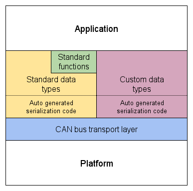

---
---

# Standard data types

<a  href="figures/architecture.png">

</a>

The higher level concepts of UAVCAN are described in this chapter.
The relation of the standard functions to other parts of the UAVCAN stack is illustrated on the diagram on the right.

Each standard data type is documented right in its DSDL definition file, so it's recommended to read that as well.

**TODO list standard types**

## Mandatory functionality

Every node in the UAVCAN network is required to broadcast the message `uavcan.protocol.NodeStatus`
at least once a second.

Other than that, a node is not required to perform any special tasks to operate in the network.
For instance, a sensor node can begin publishing measurements immediately after power up,
provided that it also broadcasts the message of type `uavcan.protocol.NodeStatus`.

### uavcan.protocol.NodeStatus

This message contains the field indicating the node health code and operational mode.
This feature is particularly important for the system's self-diagnostics,
as it allows to easily determine the overall system health and detect problem nodes.

The following table describes the defined node status codes and provides example situations where
each status code can be appropriate.

**TODO**

This message also contains the field indicating the amount of time that has passed since the node started (in seconds),
and a field for a 16-bit long vendor-specific status code. Please refer to the DSDL description for details.

## Network compatibility check

In some cases, the node may need to ensure that it can be safely connected to the network with no Node ID collisions
or data type compatibility issues; in which case, it should perform a Network Compatibility Check.

The network compatibility check ensures that a given node conforms to the following conditions:

* It has a unique Node ID within the network (works always).
* All of its data types are compatible with the same data types known to other nodes in the network
(works only with nodes that provide the required services).

Please note that some nodes may not support the services required to perform a data type compatibility check;
so, in the presence of such nodes in the network, the results of the check will not be reliable.
However, in most cases, this should not impair network safety because data type incompatibility will cause
a CRC mismatch on multi-frame transfers (refer to the CAN bus transport layer specification).

Network compatibility check algorithm:

1. Broadcast the message of type `uavcan.protocol.GlobalDiscoveryRequest` once.
2. Begin collecting the list of nodes available in the network by means of subscribing to `uavcan.protocol.NodeStatus`.
3. Wait at least 1 second. Implementations may add an arbitrary delay here to reduce the probability of
network overload when multiple nodes start up at the same time.
4. Make sure there are no nodes in the network with the same Node ID as on the local node.
Otherwise, the check has failed.
5. For each discovered node,
  1. Query the service `uavcan.protocol.ComputeAggregateTypeSignature`
on the remote node with the following request fields:
    1. `request.known_ids` - a bit mask, where the bit at index **X** will be set only if there is a known
message data type with Data Type ID **X** on the local node.
    2. `request.kind.value` set to `kind.MESSAGE`
  2. If the remote node has failed to respond in 1 second, assume that it does not implement the service
`uavcan.protocol.ComputeAggregateTypeSignature` and continue with the next node.
  3. Compute the aggregate data type signature for the local message data types indicated in the bit mask
`response.known_ids`.
  4. Make sure the computed aggregate signature equals `response.aggregate_signature`. Otherwise, the check has failed.
  5. Query the service `uavcan.protocol.ComputeAggregateTypeSignature` on the
remote node with the following request fields:
    1. `request.known_ids` - a bit mask, where the bit at index **X** will be set only if there is a
known service data type with Data Type ID **X** on the local node.
    2. `request.kind.value` set to `kind.SERVICE`
  6. Make sure the remote node managed to respond in 1 second. Otherwise, retry or continue with the next node.
  7. Compute the aggregate data type signature for the local service data types indicated in the bit mask
`response.known_ids`.
  8. Make sure the computed aggregate signature equals `response.aggregate_signature`. Otherwise, the check has failed.

The concepts of data type compatibility and aggregate data type signature are discussed in the DSDL specification
chapter.

## Node discovery

In order to collect the list of all nodes present in the network, one should subscribe to the message of type
`uavcan.protocol.NodeStatus` and listen for at least 1 second.
For each received message, add the value of Source Node ID to the resulting list of all nodes if it's not there yet.

Optionally, the message of type `uavcan.protocol.GlobalDiscoveryRequest` can be published once,
which will cause all nodes that support this message to publish `uavcan.protocol.NodeStatus` immediately.

Additional info about each node can be retrieved using the services from the namespace `uavcan.protocol`, e.g.,
`uavcan.protocol.GetNodeInfo`.
Note that these services are not mandatory, so some nodes may not support them
(this will cause the service call to time out).

Support for the following services is highly recommended to make the node more identifiable:

* `uavcan.protocol.ComputeAggregateTypeSignature` - Allows to check the data type compatibility and retrieve
the list of all supported data types in two queries.
* `uavcan.protocol.GetDataTypeInfo` - Allows to check the role in the data flow (publisher/subscriber/server).
* `uavcan.protocol.GetNodeInfo` - Allows to detect the vendor, model, software, and hardware versions.

Note that the reference implementation provides support for all recommended services by default.

## Time synchronization

UAVCAN supports network-wide precise time synchronization with a resolution of up to 1 CAN bus bit period
(i.e., 1 microsecond for 1 Mbps CAN bit rate), assuming that CAN frame timestamping is supported by the hardware.
Nodes with no hardware timestamping support will be able to synchronize too, but will likely have a lower precision
and/or will need a much longer time for their clock adjustment algorithm to converge.

The time synchronization approach is based on the work
["Implementing a Distributed High-Resolution Real-Time Clock using the CAN-Bus" (M. Gergeleit and H. Streich)](http://www.researchgate.net/publication/243777795_Implementing_a_distributed_high-resolution_real-time_clock_using_the_CAN-bus).
The general idea is to have one or more nodes that periodically broadcast a message of type
`uavcan.protocol.GlobalTimeSync` containing the exact timestamp of the previous transmission of this message.
A node that performs a periodic broadcast of this message is referred to as a **time synchronization master**,
whereas a node that synchronizes its time with the master is referred to as a **time synchronization slave**.

Note that this algorithm only allows to precisely estimate the phase difference between the given slave and
the master it is synced with.
UAVCAN does not define the algorithm for clock speed/phase adjustment, which is entirely implementation defined.

The following constants are defined for the time synchronization algorithm:

* `MAX_PUBLICATION_PERIOD` - maximum broadcast interval for a given master.
* `MIN_PUBLICATION_PERIOD` - minimum broadcast interval for a given master.
* `PUBLISHER_TIMEOUT` - if the master was not broadcasting the time synchronization message for this amount of time,
all slaves shall switch to the next active master with the highest priority.

Please refer to the definition of message type `uavcan.protocol.GlobalTimeSync` to determine the exact values for each constant.

The network may accommodate more than one time synchronization master working at the same time.
In this case, only the master with the lowest Node ID is considered to be active;
other masters should synchronize with the active one.
When the currently active master does not broadcast the time synchronization messages for the duration of
`PUBLISHER_TIMEOUT`, the next master with the highest priority becomes active and all slaves will
synchronize with it.
When a higher priority master appears in the network, all other slaves will synchronize with it immediately.

The message `uavcan.protocol.GlobalTimeSync` contains one field of type `uint64`, containing the exact timestamp
of the previous transmission of this message.
If the previous message was not yet transmitted, or if it was transmitted more than
`MAX_PUBLICATION_PERIOD` time units ago, the field must be set to zero.

Time synchronization algorithms for a master and a slave are defined in pseudocode below;
please refer to the existing implementations to see the actual code.

### Time sync master pseudocode

```c++
// State variables:
transfer_id := 0;
previous_tx_timestamp[NUM_IFACES] := 0;

// This function broadcasts a message with a specified Transfer ID using only one iface:
function broadcastMessage(transfer_id, iface_index, msg);

function messageTxTimestampCallback(iface_index, tx_timestamp)
{
    previous_tx_timestamp[iface_index] := tx_timestamp;
}

// Publishes the message of type uavcan.protocol.GlobalTimeSync to each available interface (please refer to the DSDL definition)
function broadcastTimeSync()
{
    // TODO: make sure the publishing interval is not lower than MIN_PUBLICATION_PERIOD

    message := uavcan.protocol.GlobalTimeSync();

    for (i := 0; i < NUM_IFACES; i++)
    {
        message.previous_transmission_timestamp_usec := previous_tx_timestamp[i];
        previous_tx_timestamp[i] := 0;
        broadcastMessage(transfer_id, i, message);
    }

    transfer_id++; // Overflow must be handled correctly
}
```

### Time sync slave pseudocode

```c++
// State variables:
previous_rx_timestamp := 0;               // This time is being synchronized
previous_rx_monotonic_timestamp := 0;     // This is the monotonic time (doesn't jump or change rate)
previous_transfer_id := 0;
state := STATE_UPDATE;       // STATE_UPDATE, STATE_ADJUST
master_node_id := -1;        // Invalid value
iface_index := -1;           // Invalid value

// This function performs local clock adjustment:
function adjustLocalTime(phase_error);

function adjust(message)
{
    // Clock adjustment will be performed every second message
    local_time_phase_error := previous_rx_timestamp - msg.previous_transmission_timestamp_usec;
    adjustLocalTime(local_time_phase_error);
    state := STATE_UPDATE;
}

function update(message)
{
    // Message is assumed to have two timestamps:
    //   Real - sampled from the clock that is being synchronized
    //   Monotonic - clock that never jumps and never changes rate
    previous_rx_timestamp := message.rx_timestamp;
    previous_rx_monotonic_timestamp := message.rx_monotonic_timestamp;
    master_node_id := message.source_node_id;
    iface_index := message.iface_index;
    previous_transfer_id := message.transfer_id;
    state := STATE_ADJUST;
}

// Accepts the message of type uavcan.protocol.GlobalTimeSync (please refer to the DSDL definition)
function handleReceivedTimeSyncMessage(message)
{
    time_since_previous_msg := message.monotonic_timestamp - previous_rx_monotonic_timestamp;

    // Resolving the state flags:
    needs_init := (master_node_id < 0) || (iface_index < 0);
    switch_master := message.source_node_id < master_node_id;
    publisher_timed_out := time_since_previous_msg > PUBLISHER_TIMEOUT;

    if (needs_init || switch_master || publisher_timed_out)
    {
        update(message);
    }
    else if ((message.iface_index == iface_index) && (message.source_node_id == master_node_id))
    {
        // Revert the state to STATE_UPDATE if needed
        if (state == STATE_ADJUST)
        {
            msg_invalid := message.previous_transmission_timestamp_usec == 0;
            wrong_tid := message.transfer_id != (previous_transfer_id + 1);    // Overflow must be handled correctly
            wrong_timing := time_since_previous_msg > MAX_PUBLICATION_PERIOD;
            if (msg_invalid || wrong_tid || wrong_timing)
            {
                state := STATE_UPDATE;
            }
        }
        // Handle the current state
        if (state == STATE_ADJUST)
        {
            adjust(message);
        }
        else
        {
            update(message);
        }
    }
    else
    {
        ; // Ignore this message
    }
}
```

## Node configuration

UAVCAN defines standard services for retrieving/updating remote node configuration parameters.
Support for these services is not mandatory but is highly recommended. These services are as follows:

* `uavcan.protocol.param.GetSet` - Gets or sets a single configuration parameter value, either by name or by index.
* `uavcan.protocol.param.ExecuteOpcode` - Allows to control the node configuration,
including saving the configuration to non-volatile memory, or resetting the configuration to defaults.
* `uavcan.protocol.RestartNode` - Restarts a node remotely.
Some nodes may require a restart before the new configuration parameters can be applied.

In some cases, node configuration is more complex than can be conveniently accessed via these services.
If this is the case, the node is recommended to support configuration through configuration files accessible via
the standard file transfer messages from the namespace `uavcan.protocol.file`.

### Standard parameters

There are some configuration parameters that are common for most UAVCAN nodes.
Examples of such common parameters include message publication frequencies, non-default data type ID settings,
and local node ID. UAVCAN specification improves compatibility by means of providing the following naming
conventions for UAVCAN-related configuration parameters.
Following these conventions is highly encouraged, but not mandatory.
If the designer chose to not follow the conventions, it is highly recommended to consider at least exposing
compatible interface through the standard configuration services documented above.

As can be seen below, all standard UAVCAN-related parameters share the same prefix `uavcan.`.

#### Data type ID

Parameter name: `uavcan.dtid-X`, where **X** stands for the full data type name, e.g.
`uavcan.dtid-uavcan.equipment.gnss.Fix`.

This parameter configures the data type ID value for a given data type.

#### Message publication period

Parameter name: `uavcan.pubp-X`, where **X** stands for the full data type name; e.g.
`uavcan.pubp-uavcan.protocol.NodeStatus`.

This parameter configures the publication period for a given data type, in integer number of microseconds.
Zero value means that publication should be disabled.

#### Transfer priority

Parameter name: `uavcan.prio-X`, where **X** stands for the full data type name, e.g.
`uavcan.prio-uavcan.protocol.NodeStatus`.

This parameter configures the transport priority level that will be used when publishing messages or
calling services of a given data type.

#### Node ID

Parameter name: `uavcan.node_id`.

This parameter configures ID of the local node.
Zero means that the node ID is unconfigured, which may prompt the node to resort to dynamic node ID
allocation after startup.

#### CAN bus bit rate

Parameter name: `uavcan.bit_rate`.

This parameter configures CAN bus bitrate.
Please refer to the hardware design recommendations for recommended values and other details.

#### Instance ID

Parameter name: `uavcan.id-X-Y`, where **X** is namespace name; **Y** is ID field name.

Some UAVCAN messages (standard and possibly vendor-specific ones) use special fields that identify the instance of
a certain function - **ID fields**.
For example, messages related to actuator control use fields named `actuator_id`,
some sensor messages use fields named `sensor_id`, etc.
In order to improve compatibility, the specification offers a naming convention for parameters that define the
values used in ID fields.

Given messages located in the namespace **X** that share an ID field named **Y**,
corresponding parameter name would be `uavcan.id-X-Y`.
For example, parameter for the field `esc_index` that is used in message `uavcan.equipment.esc.Status`
and that defines the array index in `uavcan.equipment.esc.RawCommand`, will be named as follows:

    uavcan.id-uavcan.equipment.esc-esc_index

In case if an ID field is shared across different namespaces,
then the most common outer shared namespace should be used as **X**.
This is not the case for any of the standard messages, so an example cannot be provided.

In case if an ID field is used in the standard namespace (`uavcan.*`) and in some vendor-specific namespaces
at the same time, the prefix should be used as though the ID field was used only in the standard namespace.

## Panic mode

Once a mission-critical node detects a fatal malfunction that makes the operation of the whole system impossible,
the node may opt to start broadcasting the message `uavcan.protocol.Panic`.
Other nodes can react to this message accordingly in order to minimize further damage,
e.g., shutdown the motors, deploy a safety parachute, engage a distress beacon, etc.

Some of the possible reasons for the panic mode:

* Failure of all redundant mission-critical functions (e.g., IMUs, autopilots, power supply units)
* Power supply failure
* Structural damage to the airframe
* Emergency stop request

The constants that define the timings and thresholds of the panic mode are defined in the DSDL definition of
`uavcan.protocol.Panic`.

## Pre-operational checks

UAVCAN provides two standard services that can be invoked prior to mission start or during general vehicle
diagnostics for each node that provides them: self-test and automatic calibration.
The purpose of these services is to execute the pre-operational self-test procedures and perform an
automatic self-calibration, when applicable.

The service types are as follows:

* `uavcan.equipment.PerformAutomaticSelfTest`
* `uavcan.equipment.PerformAutomaticCalibration`

Since these procedures may take a long time to complete, nodes are allowed to execute them asynchronously.
In this case, the node responds to the service call immediately, specifying the maximum amount of time it
needs to complete the procedure (please refer to the service definitions).
When the procedure is completed, the node sets its generic status code accordingly
(e.g., OK or CRITICAL; refer to the message `uavcan.protocol.NodeStatus`).
The caller then checks the node status upon delay expiration.

Sequence for a pre-operational check:

1. Make sure all nodes have the status OK (refer to the message `uavcan.protocol.NodeStatus`); abort otherwise.
2. For each node that provides the service `uavcan.equipment.PerformAutomaticSelfTest`, call the service;
abort the mission in case of failure. Save the longest returned delay.
3. Wait for the longest delay expiration.
4. Make sure all nodes have the status OK; abort otherwise.
5. For each node that provides the service `uavcan.equipment.PerformAutomaticCalibration`, call the service;
abort the mission in case of failure. Save the longest returned delay.
6. Wait for the longest delay expiration.
7. Make sure all nodes have the status OK; abort otherwise.

Whether the node supports a particular service type can be determined using the service
`uavcan.protocol.GetDataTypeInfo` (if it's supported of course, which is strongly recommended).

## Debug features

The following messages and services are designed to augment node debugging via UAVCAN:

* `uavcan.protocol.debug.LogMessage` - This message carries an arbitrary human-readable log message.
Note that this message type has the lowest possible arbitration priority to avoid interfering with other functions,
so it can be used even on a normally functioning vehicle.
* `uavcan.protocol.debug.KeyValue` - This message carries an arbitrary named value.
This message has a very low arbitration priority as well.
* `uavcan.protocol.debug.StartHILSimulation` - This service puts the node into HIL simulation mode.

Please refer to the DSDL definitions to learn more.

## File transfer and remote firmware update

Basic file operations are supported through the services in the namespace `uavcan.protocol.file`.

Remote firmware update is supported via the service `uavcan.protocol.file.BeginFirmwareUpdate`.

Please refer to the DSDL definitions for the detailed description.

## Passive mode

Passive mode is an operational mode that requires the given node to not transmit any CAN frames whatsoever to the bus.
It can be used for, e.g., network monitoring tools.

Passive mode is purely an implementation feature, so the UAVCAN specification does not impose any requirements here.
